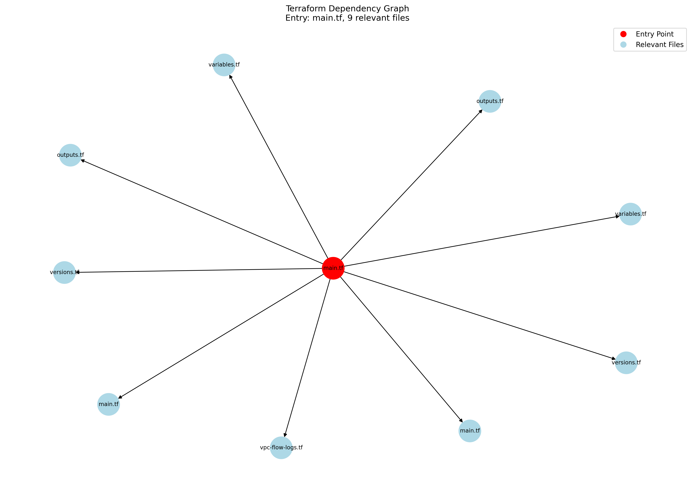

# Terraform VPC Security Enhancer

A tool for automatically enhancing AWS VPC configurations with security best practices by leveraging Claude AI.



## Overview

This tool analyzes Terraform AWS VPC configurations, identifies security improvement opportunities, and automatically enhances the code to implement security best practices. It uses Claude AI to understand the existing infrastructure code and suggest appropriate security enhancements.

## Features

- **Automated Security Enhancements**:
  - Network ACLs with strict inbound/outbound rules
  - VPC flow logs for traffic monitoring
  - Security Group hardening with least privilege access
  - Encryption for S3 endpoints
  - VPC Endpoint policies with proper restrictions

- **Advanced Analysis**:
  - Module dependency graph visualization
  - Automatic detection of related Terraform files
  - Smart context management for AI prompts

- **Processing Options**:
  - Individual file processing (default)
  - Batch processing of all files together

## Requirements

- Python 3.10 or higher
- Git
- Terraform CLI (To install go to this link: https://developer.hashicorp.com/terraform/install)
- Anthropic API key for Claude

## Installation

1. Clone this repository:
   ```bash
   git clone https://github.com/yourusername/terraform-vpc-security-enhancer.git
   cd terraform-vpc-security-enhancer
   ```

2. Install dependencies:
   ```bash
   pip install -r requirements.txt
   ```

3. Set up your Anthropic API key:
   ```bash
   export ANTHROPIC_API_KEY=your_api_key_here
   ```
   or create .env file with `ANTHROPIC_API_KEY=your_api_key_here`

## Usage

### Basic Usage

Run the script with default settings to analyze and enhance a Terraform AWS VPC module:

```bash
python scriptv3.py
```

By default, this will:
1. Clone the terraform-aws-vpc repository
2. Analyze the /complete dir example
3. Generate security enhancements for each Terraform file
4. Save the enhanced files to `./modified_code/`

### Advanced Usage

Specify a different example path:

```bash
python scriptv3.py --example-path examples/ipam
```

Process all files together in one batch (instead of individually):

```bash
python scriptv3.py --batch-process
```

Run in dry-run mode (generate prompts but don't apply changes):

```bash
python scriptv3.py --dry-run
```

## Command-line Options

| Option | Default | Description |
|--------|---------|-------------|
| `--repo-url` | `https://github.com/terraform-aws-modules/terraform-aws-vpc.git` | URL of the Terraform repository to enhance |
| `--example-path` | `examples/complete` | Path to the example directory within the repository |
| `--target-dir` | `terraform-aws-vpc` | Directory where the repository will be cloned |
| `--output-dir` | `modified_code` | Directory where modified code will be saved |
| `--claude-model` | `claude-3-7-sonnet-20250219` | Claude model to use for code enhancement |
| `--dry-run` | False | Generate prompt but don't apply changes with Claude |
| `--no-graph` | False | Skip generating the dependency graph visualization |
| `--batch-process` | False | Process all files together (default is individual files) |
| `--debug`, `-d` | False | Enable debug logging |

## How It Works

1. **Repository Analysis**:
   - Clones the target Terraform repository
   - Initializes Terraform to ensure modules and providers are available

2. **Dependency Graph Construction**:
   - Scans all `.tf` files in the repository
   - Analyzes module references to build a dependency graph
   - Identifies all files relevant to the entry point

3. **Graph Visualization**:
   - Creates a visual representation of the dependency graph
   - Highlights the entry point and relevant files

4. **AI Enhancement**:
   - Individual Mode: Processes each `.tf` file separately with focused context
   - Batch Mode: Processes all files together in one prompt
   - Generates security enhancements via Claude AI

5. **Result Processing**:
   - Extracts modified code from Claude's response
   - Saves enhanced files to the output directory

## Output

The tool produces:

1. **Enhanced Terraform Files**:
   - Saved in the specified output directory (default: `./modified_code/`)
   - Complete files with security enhancements, ready to be used

2. **Dependency Graph**:
   - Visual representation of file relationships (`dependency_graph.png`)
   - Red node: Entry point file
   - Blue nodes: Relevant files

3. **Logs**:
   - Detailed information about the process
   - Statistics about tokens, files, and dependencies

## Note on Terraform Validation

The tool intentionally skips Terraform validation because the enhanced files in the output directory reference modules from their original locations, which would cause validation to fail regardless of code quality.

To validate the enhanced code:
1. Copy the necessary modules to match the references in the enhanced files
2. Update module paths in the enhanced files to point to your new locations
3. Run `terraform init` and `terraform validate` manually

## Troubleshooting

### API Key Issues

If you encounter authentication errors:
- Ensure your Anthropic API key is valid
- Check that the environment variable is correctly set: `export ANTHROPIC_API_KEY=your_api_key_here`

### File Parsing Issues

If files aren't being parsed correctly:
- Use `--debug` flag to enable detailed logging
- Check for any errors in the dependency graph construction

## Example Workflow

1. **Enhance an AWS VPC module**:
   ```bash
   # Set your API key
   export ANTHROPIC_API_KEY=your_api_key_here
   
   # Run the enhancer
   python scriptv3.py
   
   # Check the output directory
   ls -la modified_code/
   ```

2. **Compare the original and enhanced files**:
   ```bash
   diff terraform-aws-vpc/examples/complete/main.tf modified_code/main.tf
   ```

3. **Review the dependency graph**:
   ```bash
   open dependency_graph.png
   ```